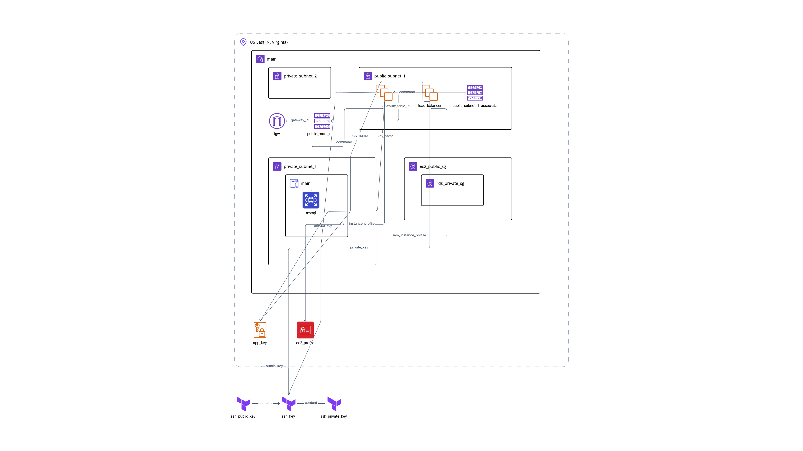

# aws-flask-mysql-ansible-app
In this project you will see how to deploy a full infrastructure with 2 EC2 servers and a loadbalancer using RDS MySQL instance and also provisioning the Amazon Linux 2 servers with Ansible and CodeDeploy. Have fun.

---

Infrastructure diagram:



---

### Once that you have this repo cloned on your local, these are the requirements to accomplish before you get started: 

---

#### Get a Free Tier AWS account.  

Note: You will need to add a credit/debit card to be able to register. 

#### Install Terraform 

This is the page in where you can find the installation method for your OS 

https://developer.hashicorp.com/terraform/tutorials/aws-get-started/install-cli 

#### Install Docker 

This is the page in where you can find the installation method for your OS 

https://docs.docker.com/desktop/setup/install/windows-install/ 

#### Install AWS CLI 

You can follow this page based on your OS 

https://docs.aws.amazon.com/cli/latest/userguide/getting-started-install.html 

#### Go to IAM and then select create New User

Add the role AWSAdministratorAccess to your new user and there it is. ***Enable MFA to avoid people entering into your account and creating resources that may cost on you***.

Now that you have whole requirements, then you need to go to you user and to create to it an access key to have the perms to read/write on AWS. 

---

To start this project you need to add a file that is called `*.auto.tfvars`. It will store all the variables that are defined in `variables.tf`, so add it and sync it with your AWS Access key and Secret value.

```
# poc.auto.tfvars

# AWS Config
region = "YOUR REGION"
aws_access_key = "YOUR ACCESS KEY"
aws_secret_key = "YOUR SECRET KEY"

# RDS Variables
# It has default values. You can see them at variables.tf, uncomment them if you want to put your own.
# db_name     = "DB NAME" 
# db_user     = "DB USER" 
# db_password = "DB PASSWORD" 

# Route 53 Variables
# zone_name      = "example.com" # Not implemented yet, due to having costs, leave it as that, it is for Route 53
# record_name    = "test-app"    # Not implemented yet, due to having costs, leave it as that, it is for Route 53

# CodeDeploy Variables
# codedeploy_app = "FLASK APP NAME" # No longer used. Now we are using Docker to deliver the app
# deploy_group_name = "DEPLOYMENT GROUP" # No longer used. Now we are using Docker to deliver the app

# ECR Variables
# ecr_repo_name = "ECR REPO NAME" DISABLED FOR NOW, using Docker Hub instead

```

Now you have whole variables defined:

# If you are in windows: 

#### First off, remember to turn on your Docker Desktop, doesn't turn on manually

# If not of if you are done with it:

## Run 

1. `terraform init`

To pull the AWS provider files to work with.

2. `terraform plan`

To see what is going to create and to see certain outputs to avoid going to AWS Console, such as EC2s IPs, Loadbalancer IP, RDS endpoint and many more.

3. `terraform apply`

To... You know, I don't think I need to explain it.

And there you go. Remember to check the AWS console each time you are done with. 

Also, if you want to use [Terraform Cloud](https://app.terraform.io/session) to track in a better way your deployment, do this:

### Locally: 

1. `terraform login`

Then follow their steps and there you go.

2. `terraform init`

3. `terraform plan`

4. `terraform apply`

# If you had enough and want to delete it, do this:

1. `terraform destroy`

and then type yes and you are all set.

### Login into Terraform Cloud:

1. Add your organization, then link it with your repo and there you go. You can store the tfstate there and also save vars/secrets. All centralized.
2. To trigger changes, you can do it manually clicking on button New Run or just by commiting new changes into the repo, that way is the best to do so.
3. To delete, go to your project, navigate into Settings> Destruction andDeletion>Queue destroy plan.

## NOTES:
In this mode, we can not provision with local exec, so go comment in ec2.tf file the provisioner local-exec for the app server and the loadbalancer if you want to do it. For pipeline purposes I am going to comment it, huwever, at my demos I am using the method above, login at your CLI instead of using the GUI. 

Also, you can use Systems Manager to deploy the Ansible playbook, so you can retrieve from the outputs the info for the loadbalancer, whcih are the ip of the servers.

#### TODO, not implemented yet

Also you gotta keep in mind that the Docker Image has 4 env variables that you can define within `./terraform/provisioning/deploy-docker.yml` docker run step at line 35. There's an example right at the code, so put them how it is supposed to in the Dockerfile, or you can create the docker image using that Dockerfile and your values.

Use this:

`docker build -t test-image-name ./flask-app`

This will read the Dockerfile by itself and create the new image with your changes (on the env vars or even you can add your own logic).
